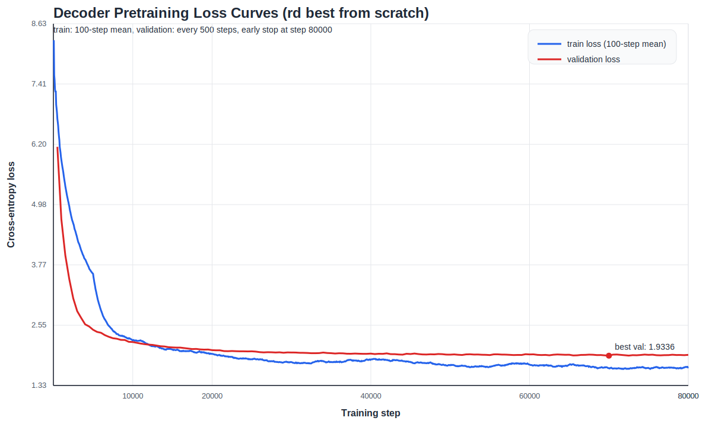

# Decoder Pretraining

Last updated: 2026-03-24

## Final Recommended Model

### Data

- dataset: `data/huggingface`
- tokenizer: `data/tokenizer_rd.json`
- training split size: `29,514`
- validation split size: `7,308`
- test split size: `9,086`

### Input

- one dataset row produces one token sequence
- `max_length = 256`
- training: random contiguous crop for overlength samples
- validation / test: deterministic prefix crop for overlength samples
- batch padding: dynamic
- language-model targets:
  - `input_tokens = tokens[:, :-1]`
  - `output_tokens = tokens[:, 1:]`

### Decoder

- model type: decoder-only Transformer language model
- vocab size: `5000`
- `d_model = 128`
- `nhead = 4`
- `num_layers = 2`
- `dim_feedforward = 512`
- `dropout = 0.0`
- positional encoding: sinusoidal

### Training

- objective: next-token prediction
- model-selection metric: validation cross-entropy loss
- `batch_size = 8`
- `learning_rate = 8e-4`
- initialization: from scratch
- run cap: `1800` seconds
- early stopping:
  - `eval_every = 500`
  - `early_stopping_patience = 20`
  - `early_stopping_min_delta = 0.0`
- safety cap: `num_steps = 1000000`

### Final Result

- best validation loss: `2.0914046755060554`
- best checkpoint: `artifacts/research/EXP-FINAL-1800-002_dmodel128_ff512_dropout0_lr8e4_bs8_scratch_es20/best.pt`
- latest checkpoint: `artifacts/research/EXP-FINAL-1800-002_dmodel128_ff512_dropout0_lr8e4_bs8_scratch_es20/latest.pt`
- actual stop condition: early stopping triggered before the `1800`-second cap
- note: this slightly outperformed the resumed run (`2.0948`), so it is the clean final recommendation

## Loss Curves

