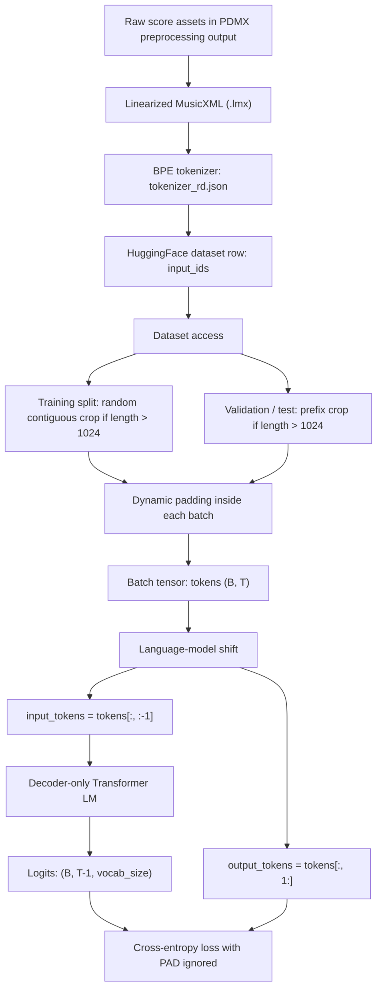
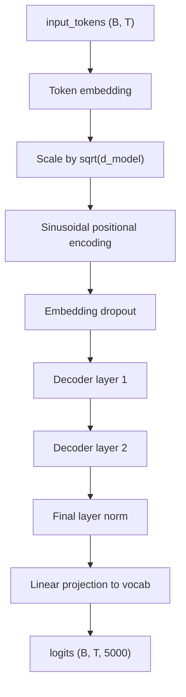
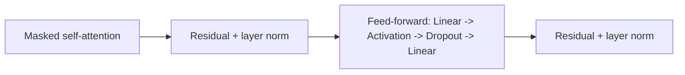

# Decoder Pretraining

Last updated: 2026-03-30

## Recommended Run At A Glance

- dataset: `data/huggingface`
- tokenizer: `data/tokenizer_rd.json`
- `max_length = 1024`
- training crop: random contiguous crop
- validation crop: deterministic prefix crop
- length bucketing: `false`
- batch padding: `dynamic`
- model: decoder-only Transformer LM
- `d_model = 256`
- `nhead = 4`
- `num_layers = 2`
- `dim_feedforward = 1024`
- `dropout = 0.0`
- positional encoding: `sinusoidal`
- `batch_size = 8`
- `learning_rate = 6e-4`
- scheduler: `linear`
- `warmup_steps = 500`
- `min_lr_ratio = 0.1`
- wall-clock cap: `3600` seconds
- best model-selection loss during training: `1.8039128640666604`
- full-validation recheck on the saved best checkpoint: `1.9305410517514143`

## Final Recommended Model

### Data

- dataset: `data/huggingface`
- tokenizer: `data/tokenizer_rd.json`
- training split size: `29,514`
- validation split size: `7,308`
- test split size: `9,086`

### Input

- one dataset row produces one token sequence
- `max_length = 1024`
- training: random contiguous crop for overlength samples
- validation / test: deterministic prefix crop for overlength samples
- training batches do not use length bucketing
- batch padding: dynamic
  - each batch is padded only to that batch's longest sample
  - implementation: `torch.nn.utils.rnn.pad_sequence(...)`
- language-model targets:
  - `input_tokens = tokens[:, :-1]`
  - `output_tokens = tokens[:, 1:]`

### Pipeline

### Tensor Shapes

- raw sample: one `input_ids` list
- after crop: up to `1024` tokens
- after dynamic padding: `tokens` with shape `(batch_size, seq_len)`
- model input: `input_tokens` with shape `(batch_size, seq_len - 1)`
- target labels: `output_tokens` with shape `(batch_size, seq_len - 1)`
- model output: `logits` with shape `(batch_size, seq_len - 1, 5000)`

### Decoder

- model type: decoder-only Transformer language model
- vocab size: `5000`
- `d_model = 256`
- `nhead = 4`
- `num_layers = 2`
- `dim_feedforward = 1024`
- `dropout = 0.0`
- positional encoding: sinusoidal

### Implementation Files

- dataset and collate:
  - [`midi2score/data/language_model_dataset.py`](/Users/daboluo/MyWorkSpace/GitHub/MIDI2Score/midi2score/data/language_model_dataset.py)
- model entrypoint:
  - [`midi2score/models/decoder_lm.py`](/Users/daboluo/MyWorkSpace/GitHub/MIDI2Score/midi2score/models/decoder_lm.py)
- decoder blocks / positional encodings:
  - [`midi2score/models/modules.py`](/Users/daboluo/MyWorkSpace/GitHub/MIDI2Score/midi2score/models/modules.py)
- model config:
  - [`midi2score/models/decoder_config.py`](/Users/daboluo/MyWorkSpace/GitHub/MIDI2Score/midi2score/models/decoder_config.py)
- training loop:
  - [`midi2score/trainers/pretrain_loop.py`](/Users/daboluo/MyWorkSpace/GitHub/MIDI2Score/midi2score/trainers/pretrain_loop.py)
- training config:
  - [`midi2score/trainers/config.py`](/Users/daboluo/MyWorkSpace/GitHub/MIDI2Score/midi2score/trainers/config.py)

### Model Graph

### Decoder Layer Graph

### Decoder Layer Details

- each layer uses masked self-attention only during decoder pretraining
- causal mask prevents token `t` from attending to future positions
- there are `2` decoder layers
- each layer contains:
  - multi-head self-attention with `4` heads
  - feed-forward block `256 -> 1024 -> 256`
  - residual connections and layer norms
- cross-attention code exists for later seq2seq fine-tuning, but it is not used in decoder pretraining

### Training

- objective: next-token prediction
- model-selection metric: validation cross-entropy loss
- `batch_size = 8`
- `learning_rate = 6e-4`
- scheduler: `linear`
- `warmup_steps = 500`
- `min_lr_ratio = 0.1`
- initialization: from scratch
- run cap: `3600` seconds
- validation cadence: `eval_every = 500`
- early stopping:
  - `early_stopping_patience = 20`
  - `early_stopping_min_delta = 0.0`
- safety cap: `num_steps = 1000000`

### Final Result

- best validation loss: `1.8039128640666604`
- full-validation recheck on the saved best checkpoint: `1.9305410517514143`
- best checkpoint: `artifacts/research/EXP-RD-LONGCTX-034_crop1024_nobucket_dmodel256_ff1024_lr6e4_bs8_linearwarmup_long/best.pt`
- latest checkpoint: `artifacts/research/EXP-RD-LONGCTX-034_crop1024_nobucket_dmodel256_ff1024_lr6e4_bs8_linearwarmup_long/latest.pt`
- actual stop condition: time-budget cap at `3600` seconds

Note:

- the lower `1.8039` number is the training-time model-selection metric computed on the configured validation subset (`num_eval_batches = 64`)
- the `1.9305` number is the later full-validation recheck over the complete validation split

## Follow-up Conclusions

### Length Bucketing

- current `rd` best branch does not use `length_bucketing`
- same `300s` recipe comparison:
  - with bucketing: `3406` steps, best validation loss `2.7204`
  - without bucketing: `5136` steps, best validation loss `2.3004`
- batch-shape benchmark over the first `512` train batches:
  - without bucketing: average padded input length `950.26`, average padding fraction `51.87%`
  - with bucketing: average padded input length `464.38`, average padding fraction `2.40%`
- dataloader-only benchmark over `1024` batches:
  - without bucketing: `1483.85` batches/s, `5.38M` non-pad tokens/s
  - with bucketing: `1543.99` batches/s, `5.43M` non-pad tokens/s
- conclusion: bucketing is reducing padding correctly, but on this `rd` recipe it hurts end-to-end MPS training, so the recommended model keeps it off

### Batch Size 16

- `batch_size = 16` looked promising in a `300s` smoke run on the older bucketing branch: best validation loss `2.5373`
- the long-budget follow-up regressed to `2.0639`
- conclusion: `batch_size = 16` is not promoted; `batch_size = 8` remains the stable choice

### Warmup / Scheduler

- `linear` warmup/decay beat `cosine` in `300s` smoke runs on the older bucketing branch
- on the strongest no-bucketing branch:
  - no scheduler: best validation loss `1.8107`
  - linear warmup/decay: best validation loss `1.8039`
- conclusion: `linear` warmup with `500` warmup steps gives a small but real improvement and is part of the current recommendation

### Dropout

- dropout logic is correct; it is active only in train mode and disabled in eval mode
- verification lives in `tests/test_decoder_pretraining.py`
- `dropout = 0.05` was clearly worse in smoke testing: best validation loss `3.7221`
- likely explanation: this setup is already regularized by random crop and early stopping, while dropout is applied at embedding, attention, FFN, and residual paths, so added noise hurts optimization more than it helps generalization

### Positional Encoding

- current recommendation keeps `position_encoding_type = sinusoidal`
- `300s` smoke comparison on the current best `rd` branch:
  - sinusoidal: best validation loss `2.2893`
  - learned absolute positional embedding: best validation loss `3.5420`
  - ALiBi: best validation loss `3.4845`
- `3600s` long-budget comparison:
  - sinusoidal: best validation loss `1.8039`
  - learned absolute positional embedding: best validation loss `2.4982`
  - ALiBi: best validation loss `2.6788`
- conclusion: both learned absolute positional embeddings and ALiBi remained clearly worse after long-budget training, so sinusoidal stays the recommended choice
