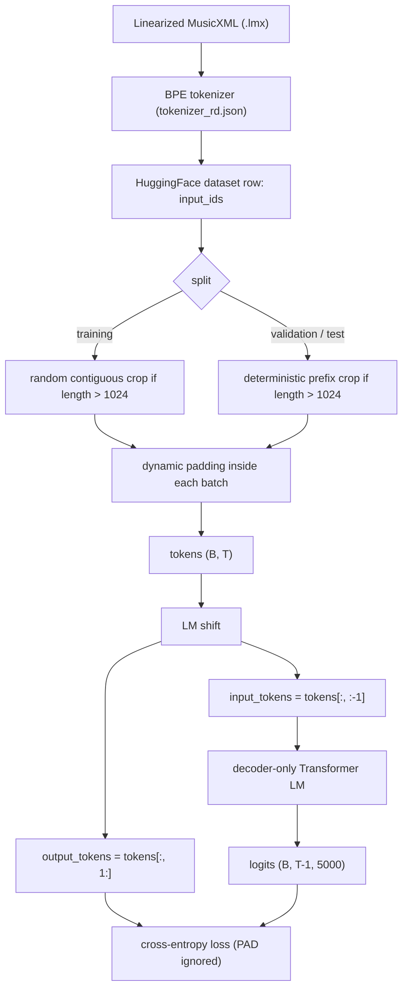
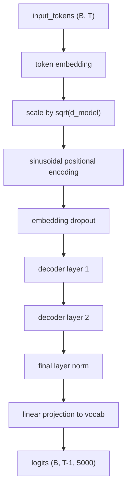
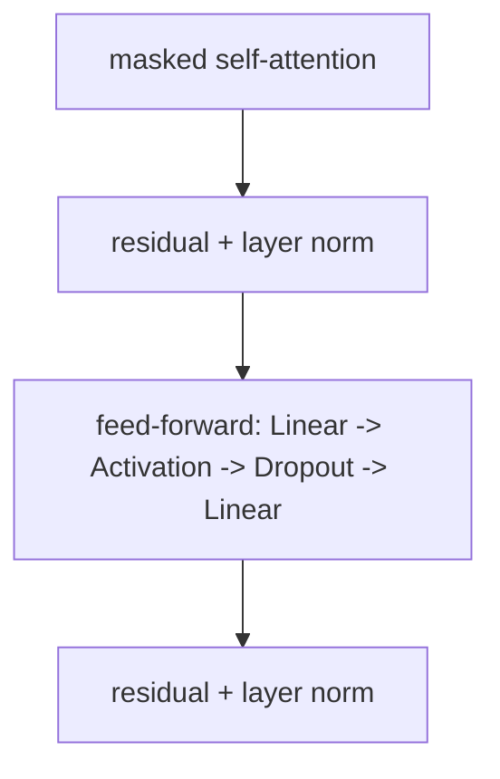

# Decoder Pretraining

Last updated: 2026-03-31

## Recommended Run At A Glance

- dataset: `data/huggingface`
- tokenizer: `data/tokenizer_rd.json`
- `max_length = 1024`
- training crop: random contiguous crop
- validation crop: deterministic prefix crop
- length bucketing: `false`
- batch padding: `dynamic`
- model: decoder-only Transformer LM
- `d_model = 256`
- `nhead = 4`
- `num_layers = 2`
- `dim_feedforward = 1024`
- `dropout = 0.0`
- `activation = relu`
- positional encoding: `sinusoidal`
- `batch_size = 8`
- `learning_rate = 6e-4`
- scheduler: `linear`
- `warmup_steps = 500`
- `min_lr_ratio = 0.1`
- continuation budget: `7200` seconds
- final reported validation CE uses the full validation split
- full-validation metrics on the saved best checkpoint:
  - CE loss: `1.9169`
  - perplexity: `6.8000`
  - token accuracy: `0.5908`
  - top-5 accuracy: `0.7812`

## Final Recommended Model

### Data

- dataset: `data/huggingface`
- tokenizer: `data/tokenizer_rd.json`
- training split size: `29,514`
- validation split size: `7,308`
- test split size: `9,086`

### Input

- one dataset row produces one token sequence
- `max_length = 1024`
- training: random contiguous crop for overlength samples
- validation / test: deterministic prefix crop for overlength samples
- training batches do not use length bucketing
- batch padding: dynamic
  - each batch is padded only to that batch's longest sample
  - implementation: `torch.nn.utils.rnn.pad_sequence(...)`
- special tokens:
  - `PAD = 0`
  - `BOS = 1`
  - `EOS = 2`
- language-model targets:
  - `input_tokens = tokens[:, :-1]`
  - `output_tokens = tokens[:, 1:]`

### Pipeline



| Stage | Input | Output | Notes |
| --- | --- | --- | --- |
| Preprocessing asset | raw score files | `.lmx` files | upstream preprocessing emits Linearized MusicXML |
| Tokenization | `.lmx` | `input_ids` | tokenizer: `data/tokenizer_rd.json` |
| Dataset row | `input_ids` list | one sample | one row corresponds to one token sequence |
| Length control | one sample | trimmed token sequence | training uses random contiguous crop; validation/test use deterministic prefix crop |
| Batch collation | list of trimmed sequences | `tokens` with shape `(B, T)` | dynamic padding to the longest sample in the batch |
| LM shift | `tokens` | `input_tokens`, `output_tokens` | `input_tokens = tokens[:, :-1]`, `output_tokens = tokens[:, 1:]` |
| Forward pass | `input_tokens` | `logits` | decoder-only Transformer outputs `(B, T-1, vocab_size)` |
| Loss | `logits`, `output_tokens` | scalar cross-entropy | PAD positions are ignored |

### Tensor Shapes

| Tensor | Shape | Meaning |
| --- | --- | --- |
| raw sample | one `input_ids` list | tokenized LMX sequence from the HuggingFace dataset |
| cropped sample | up to `1024` tokens | after random crop or deterministic prefix crop |
| `tokens` | `(batch_size, seq_len)` | batch after dynamic padding |
| `input_tokens` | `(batch_size, seq_len - 1)` | decoder input tokens |
| `output_tokens` | `(batch_size, seq_len - 1)` | next-token labels |
| `padding_mask` | `(batch_size, seq_len - 1)` | `True` where the position is PAD |
| `logits` | `(batch_size, seq_len - 1, 5000)` | token logits over the vocabulary |

### Decoder

- model type: decoder-only Transformer language model
- vocab size: `5000`
- `d_model = 256`
- `nhead = 4`
- `num_layers = 2`
- `dim_feedforward = 1024`
- `dropout = 0.0`
- `activation = relu`
- positional encoding: sinusoidal

### Implementation Files

- dataset and collate:
  - [`midi2score/data.py`](/Users/daboluo/MyWorkSpace/GitHub/MIDI2Score/midi2score/data.py)
- model entrypoint:
  - [`midi2score/model.py`](/Users/daboluo/MyWorkSpace/GitHub/MIDI2Score/midi2score/model.py)
- model config:
  - [`midi2score/model.py`](/Users/daboluo/MyWorkSpace/GitHub/MIDI2Score/midi2score/model.py)
- training loop:
  - [`midi2score/train.py`](/Users/daboluo/MyWorkSpace/GitHub/MIDI2Score/midi2score/train.py)
- training config:
  - [`midi2score/train.py`](/Users/daboluo/MyWorkSpace/GitHub/MIDI2Score/midi2score/train.py)

### Model Stack



```text
input_tokens (B, T)
-> token embedding
-> scale by sqrt(d_model)
-> sinusoidal positional encoding
-> embedding dropout
-> decoder layer 1
-> decoder layer 2
-> final layer norm
-> linear projection to vocab
-> logits (B, T-1, 5000)
```

### Decoder Layer Details



| Layer step | Operation | Notes |
| --- | --- | --- |
| 1 | masked self-attention | causal mask prevents token `t` from attending to future positions |
| 2 | residual + layer norm | first normalization point |
| 3 | feed-forward block | `256 -> 1024 -> 256` with activation and dropout |
| 4 | residual + layer norm | second normalization point |

Additional notes:

- there are `2` decoder layers in the recommended model
- each layer uses `4` attention heads
- cross-attention code exists for later seq2seq fine-tuning, but it is not used in decoder pretraining

### Training

- objective: next-token prediction
- model-selection metric during training: validation cross-entropy loss
- additional validation metrics:
  - perplexity
  - token accuracy
  - top-5 accuracy
- `batch_size = 8`
- `learning_rate = 6e-4`
- scheduler: `linear`
- `warmup_steps = 500`
- `min_lr_ratio = 0.1`
- initialization: resumed from the previous `3600s` run's `latest.pt`
- continuation cap: `7200` seconds
- validation cadence: `eval_every = 500`
- final reported metrics are computed on the full validation split
- early stopping:
  - `early_stopping_patience = 20`
  - `early_stopping_min_delta = 0.0`
- safety cap: `num_steps = 1000000`
- loss details:
  - next-token cross-entropy
  - `ignore_index = pad_token_id`

### Final Result

- training-time best validation loss on subset eval (`num_eval_batches = 64`): `1.7874`
- full-validation metrics on the saved best checkpoint:
  - CE loss: `1.9169`
  - perplexity: `6.8000`
  - token accuracy: `0.5908`
  - top-5 accuracy: `0.7812`
- best checkpoint: `artifacts/research/EXP-RD-LONGCTX-037_crop1024_nobucket_dmodel256_ff1024_lr6e4_bs8_linearwarmup_resume7200/best.pt`
- latest checkpoint: `artifacts/research/EXP-RD-LONGCTX-037_crop1024_nobucket_dmodel256_ff1024_lr6e4_bs8_linearwarmup_resume7200/latest.pt`
- actual stop condition: early stopping after the resumed run

Note:

- the lower `1.7874` number is the training-time model-selection metric computed on the configured validation subset (`num_eval_batches = 64`)
- the final reported numbers above are the full-validation metrics over the complete validation split
- this best checkpoint came from continuing the prior `3600s` run with optimizer and scheduler state restored
- training still selects checkpoints by validation cross-entropy; the extra metrics are for diagnosis and comparison
- a separate from-scratch `7200s` run with full validation during training reached:
  - training-time best full-validation CE: `1.9331`
  - it did not beat the resumed best checkpoint on full-validation CE (`1.9169`)

## Follow-up Conclusions

### Length Bucketing

- current `rd` best branch does not use `length_bucketing`
- same `300s` recipe comparison:
  - with bucketing: `3406` steps, best validation loss `2.7204`
  - without bucketing: `5136` steps, best validation loss `2.3004`
- batch-shape benchmark over the first `512` train batches:
  - without bucketing: average padded input length `950.26`, average padding fraction `51.87%`
  - with bucketing: average padded input length `464.38`, average padding fraction `2.40%`
- dataloader-only benchmark over `1024` batches:
  - without bucketing: `1483.85` batches/s, `5.38M` non-pad tokens/s
  - with bucketing: `1543.99` batches/s, `5.43M` non-pad tokens/s
- conclusion: bucketing is reducing padding correctly, but on this `rd` recipe it hurts end-to-end MPS training, so the recommended model keeps it off

### Batch Size 16

- `batch_size = 16` looked promising in a `300s` smoke run on the older bucketing branch: best validation loss `2.5373`
- the long-budget follow-up regressed to `2.0639`
- conclusion: `batch_size = 16` is not promoted; `batch_size = 8` remains the stable choice

### Warmup / Scheduler

- `linear` warmup/decay beat `cosine` in `300s` smoke runs on the older bucketing branch
- on the strongest no-bucketing branch:
  - no scheduler: best validation loss `1.8107`
  - linear warmup/decay: best validation loss `1.8039`
- conclusion: `linear` warmup with `500` warmup steps gives a small but real improvement and is part of the current recommendation

### Dropout

- dropout logic is correct; it is active only in train mode and disabled in eval mode
- verification lives in `tests/test_decoder_pretraining.py`
- `dropout = 0.05` was clearly worse in smoke testing: best validation loss `3.7221`
- likely explanation: this setup is already regularized by random crop and early stopping, while dropout is applied at embedding, attention, FFN, and residual paths, so added noise hurts optimization more than it helps generalization

### Positional Encoding

- current recommendation keeps `position_encoding_type = sinusoidal`
- `300s` smoke comparison on the current best `rd` branch:
  - sinusoidal: best validation loss `2.2893`
  - learned absolute positional embedding: best validation loss `3.5420`
  - ALiBi: best validation loss `3.4845`
- `3600s` long-budget comparison:
  - sinusoidal: best validation loss `1.8039`
  - learned absolute positional embedding: best validation loss `2.4982`
  - ALiBi: best validation loss `2.6788`
- conclusion: both learned absolute positional embeddings and ALiBi remained clearly worse after long-budget training, so sinusoidal stays the recommended choice
