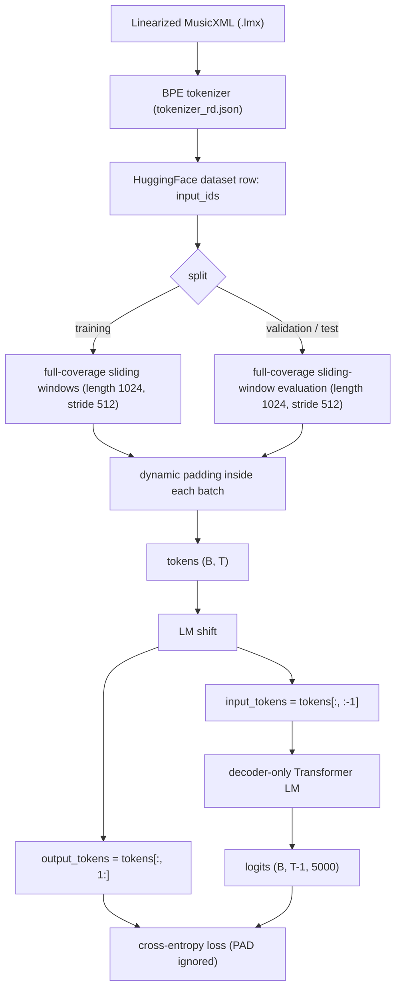
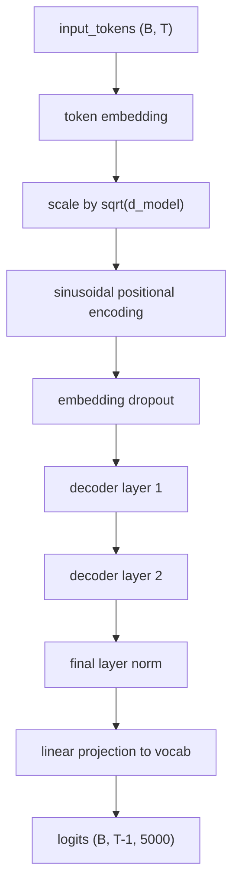
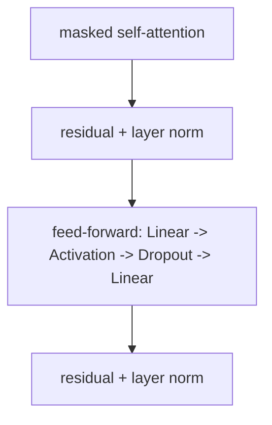
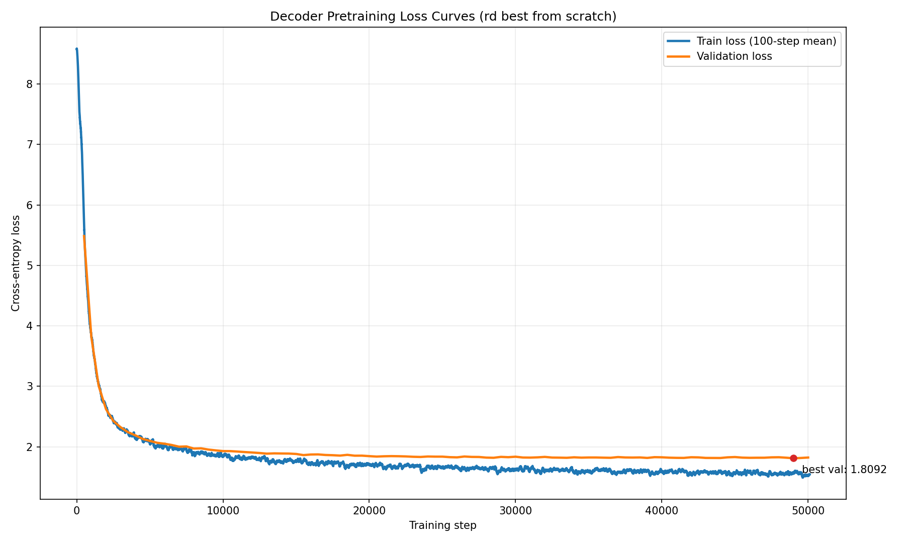

# Decoder Pretraining

Last updated: 2026-04-06

## Overview

This document describes the current `rd` decoder pretraining pipeline, the official best configuration, and the main methodological choices behind it.

The current system is a decoder-only Transformer language model trained on tokenized Linearized MusicXML (LMX) sequences. The model is trained with next-token prediction and evaluated with full-coverage sliding-window validation so that every validation target token is counted exactly once.

## Current Official Best

- runnable config: [`../configs/pretrain_rd_best.yaml`](../configs/pretrain_rd_best.yaml)
- dataset: `data/huggingface`
- tokenizer: `data/tokenizer_rd.json`
- best checkpoint: [`../artifacts/pretrained_decoder_rd_best_best.pt`](../artifacts/pretrained_decoder_rd_best_best.pt)
- latest checkpoint: [`../artifacts/pretrained_decoder_rd_best.pt`](../artifacts/pretrained_decoder_rd_best.pt)

### Best Recipe

- `max_length = 1024`
- training windows: full-coverage sliding windows
- `sliding_window_stride = 512`
- validation / test: full-coverage sliding-window evaluation
- validation / test stride: `512`
- length bucketing: `false`
- batch padding: dynamic
- model: decoder-only Transformer LM
- `d_model = 256`
- `nhead = 4`
- `num_layers = 2`
- `dim_feedforward = 1024`
- `dropout = 0.0`
- `activation = relu`
- positional encoding: `sinusoidal`
- `batch_size = 16`
- `learning_rate = 6e-4`
- scheduler: `linear`
- `warmup_steps = 500`
- `min_lr_ratio = 0.1`
- training budget: `7200` seconds

### Full-Validation Metrics

- CE loss: `1.8092`
- perplexity: `6.1053`
- token accuracy: `0.5988`
- top-5 accuracy: `0.7908`
- evaluated tokens: `4,416,152`

## Design Choices and References

The table below summarizes the main modeling and training decisions, why they are used, and the main reference behind each one.

| Component | Current Choice | Why We Use It | Reference |
| --- | --- | --- | --- |
| Data source | Reduced local split derived from PDMX | PDMX provides a large-scale public-domain MusicXML foundation for symbolic music processing | [PDMX](https://arxiv.org/abs/2409.10831) |
| Tokenization | BPE tokenizer, vocab size `5000` | Subword tokenization is a standard way to build a compact discrete vocabulary from symbolic sequences | [Sennrich et al. 2016](https://aclanthology.org/P16-1162/) |
| Model family | Decoder-only Transformer LM | The project needs target-side autoregressive score modeling; masked self-attention is the standard Transformer decoder setup | [Attention Is All You Need](https://arxiv.org/abs/1706.03762) |
| Objective | Next-token cross-entropy | Standard causal language modeling objective for autoregressive decoders | [Hugging Face fixed-length perplexity notes](https://huggingface.co/docs/transformers/perplexity) |
| Dynamic padding | Pad each batch to its own longest sequence | Avoids global fixed-length padding and keeps batching efficient for variable-length symbolic sequences | [PyTorch `pad_sequence`](https://docs.pytorch.org/docs/stable/generated/torch.nn.utils.rnn.pad_sequence.html), [Hugging Face Data Collator](https://huggingface.co/docs/transformers/v4.50.0/main_classes/data_collator) |
| Training windowing | `1024`-token full-coverage sliding windows with stride `512` | Keeps a fixed context length while ensuring long training sequences are fully used instead of being reduced to a single random crop | [Transformer-XL](https://arxiv.org/abs/1901.02860), [Hugging Face fixed-length perplexity notes](https://huggingface.co/docs/transformers/perplexity) |
| Validation windowing | Full-coverage sliding-window evaluation with overlap-aware loss masking | Fixed-length models should not be evaluated only on disjoint chunks or short prefixes; overlap improves context and loss masking prevents double counting | [Hugging Face fixed-length perplexity notes](https://huggingface.co/docs/transformers/perplexity) |
| Optimizer | Adam | Standard first-order optimizer for Transformer training | [Adam](https://arxiv.org/abs/1412.6980) |
| LR schedule | Linear warmup + decay | Stable default for Transformer optimization; also consistent with common Hugging Face scheduler practice | [Hugging Face optimizer schedules](https://huggingface.co/docs/transformers/main_classes/optimizer_schedules) |

### Note on Sliding-Window Training

The **training** sliding-window strategy is an engineering choice rather than a direct copy of a single paper. The reasoning is:

- the model has a fixed maximum context length (`1024`)
- very long sequences should not be reduced to a single training crop
- sliding windows let us keep the fixed-context model while covering nearly all training tokens

This is conceptually aligned with the motivation behind fixed-length evaluation guidance and the context-fragmentation discussion in Transformer-XL, even though our implementation remains a standard Transformer decoder without segment recurrence.

## End-to-End Pipeline

## Data and Sequence Handling

### Dataset

- dataset: `data/huggingface`
- tokenizer: `data/tokenizer_rd.json`
- training split size: `29,514`
- validation split size: `7,308`
- test split size: `9,086`

### Special Tokens

- `PAD = 0`
- `BOS = 1`
- `EOS = 2`

### Sequence Policy

- one dataset row produces one token sequence
- `max_length = 1024`
- training:
  - full-coverage sliding windows with stride `512`
  - no random crop
- validation / test:
  - full-coverage sliding-window evaluation with stride `512`
  - overlapping windows use a loss mask so each target token is scored exactly once
- batch collation:
  - dynamic padding to the longest sequence in the batch

### Why Not Prefix-Only Validation

For fixed-length models, evaluating only the first `1024` tokens of a long sequence underuses the available left context and ignores the rest of the sequence. We therefore use sliding-window validation so that:

- long sequences are evaluated beyond the prefix
- each token gets as much left context as the fixed window allows
- no overlapping target token is counted twice

## Tensor Shapes

| Tensor | Shape | Meaning |
| --- | --- | --- |
| raw sample | one `input_ids` list | tokenized LMX sequence from the HuggingFace dataset |
| training / evaluation window | up to `1024` tokens | after sliding-window expansion |
| `tokens` | `(batch_size, seq_len)` | batch after dynamic padding |
| `input_tokens` | `(batch_size, seq_len - 1)` | decoder inputs |
| `output_tokens` | `(batch_size, seq_len - 1)` | next-token labels |
| `padding_mask` | `(batch_size, seq_len - 1)` | `True` where the position is PAD |
| `logits` | `(batch_size, seq_len - 1, 5000)` | vocabulary logits |

## Model Architecture

The model is a decoder-only Transformer language model.

### Decoder Specification

- vocab size: `5000`
- `d_model = 256`
- `nhead = 4`
- `num_layers = 2`
- `dim_feedforward = 1024`
- `dropout = 0.0`
- `activation = relu`
- positional encoding: sinusoidal

### Decoder Layer

Each decoder layer uses:
- hidden size `256`
- `4` attention heads
- feed-forward width `1024`

## Training and Evaluation

### Training Objective

- task: next-token prediction
- shift:
  - `input_tokens = tokens[:, :-1]`
  - `output_tokens = tokens[:, 1:]`
- loss:
  - token-level cross-entropy
  - `ignore_index = pad_token_id`

### Optimization

- optimizer: Adam
- `learning_rate = 6e-4`
- scheduler: linear warmup + decay
- `warmup_steps = 500`
- `min_lr_ratio = 0.1`
- `batch_size = 16`
- `eval_every = 500`
- `early_stopping_patience = 20`
- `early_stopping_min_delta = 0.0`
- `num_steps = 1000000` safety cap
- `max_duration_seconds = 7200`

### Evaluation Metrics

The model-selection metric during training is validation cross-entropy. Final reporting includes:

- CE loss
- perplexity
- token accuracy
- top-5 accuracy

All final metrics are computed on the **full validation split**.

## Files

### Core Implementation

- dataset and collation: [`../midi2score/data.py`](../midi2score/data.py)
- model: [`../midi2score/model.py`](../midi2score/model.py)
- training loop and evaluation: [`../midi2score/train.py`](../midi2score/train.py)
- config loader: [`../midi2score/config.py`](../midi2score/config.py)
- entrypoint: [`../run_pretrain.py`](../run_pretrain.py)

### Current Assets

- best config: [`../configs/pretrain_rd_best.yaml`](../configs/pretrain_rd_best.yaml)
- best checkpoint: [`../artifacts/pretrained_decoder_rd_best_best.pt`](../artifacts/pretrained_decoder_rd_best_best.pt)
- latest checkpoint: [`../artifacts/pretrained_decoder_rd_best.pt`](../artifacts/pretrained_decoder_rd_best.pt)
- loss plot: [`./decoder_pretrain_losses.png`](./decoder_pretrain_losses.png)

## Loss Curves

## Short Conclusions

- `1024` fixed-context training is currently the right operating point for `rd`.
- Full-coverage sliding-window training is better than using only a single crop from long training sequences.
- Full-coverage sliding-window validation is the correct reporting method for this fixed-length model.
- The strongest current `rd` recipe is the `batch_size = 16` sliding-window branch recorded in `configs/pretrain_rd_best.yaml`.
